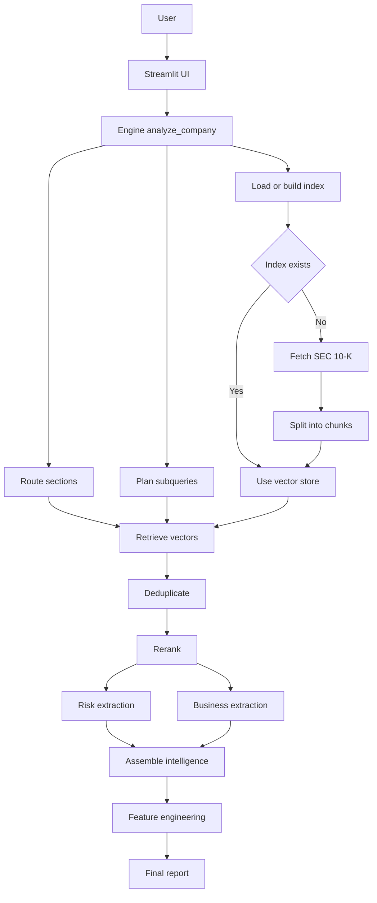

# Company Intelligence Engine

AI-powered analysis of SEC filings that produces **structured company intelligence** (risks, strengths, competitive advantage, outlook) using a **hybrid retrieval + reranking** pipeline and LLM reasoning chains.

**Hosted app:** https://company-intelligence-engine.streamlit.app/

---

## What this does

Given:
- a **company name**
- an SEC **CIK**
- an **intelligence directive** (your question)

…it will:
1. route the query to relevant filing sections (risk / business),
2. plan sub-queries,
3. retrieve evidence using hybrid retrieval (vector + BM25),
4. rerank results with a cross-encoder,
5. run reasoning chains to extract structured intelligence,
6. generate engineered features for downstream use.

---

## System architecture (flow)



---

## Repository structure

- `app.py` — Streamlit UI (hosted app entrypoint)
- `main.py` — simple CLI/test runner calling the engine
- `core/`
  - `engine.py` — orchestrates routing → retrieval → reranking → chains → features
  - `model.py` — Groq LLM configuration
  - `risk_chain.py`, `business_chain.py` — extraction/synthesis chains
  - `schema.py` — structured output schema
  - `features.py` — feature engineering layer
- `reasoning/`
  - `router.py` — Section Router
  - `query_planner.py` — Query Planner
- `rag/`
  - `embeddings.py` — embedding model
  - `hybrid_retriever.py` — vector + BM25 retrieval merge
  - `reranker.py` — cross-encoder reranker
- `data_ingestion/`
  - `sec_fetcher.py` — fetch filings
  - `sec_indexer.py` — build/load indexes
- `indexes/` — persisted indexes (generated locally)
  
---

## Requirements

This project is Python-only.

### Environment variables

The engine uses **Groq via LangChain** (`langchain_groq.ChatGroq`) and expects:

- `GROQ_API_KEY` (**required**)  
- `GROQ_MODEL` (optional, default: `llama-3.1-8b-instant`)
- `GROQ_TIMEOUT` (optional, default: `45`)
- `GROQ_MAX_RETRIES` (optional, default: `1`)

Create a `.env` file in the repo root (recommended):

```bash
GROQ_API_KEY=your_key_here
GROQ_MODEL=llama-3.1-8b-instant
GROQ_TIMEOUT=45
GROQ_MAX_RETRIES=1
```

> Note: `core/model.py` calls `load_dotenv()`, so `.env` will be picked up automatically.

---

## Run locally

### 1) Create and activate a virtual environment

```bash
python -m venv .venv
# macOS/Linux:
source .venv/bin/activate
# Windows (PowerShell):
.venv\Scripts\Activate.ps1
```

### 2) Install dependencies

There is currently **no** `requirements.txt` or `pyproject.toml` checked in, so install based on imports used in the repo:

```bash
pip install streamlit requests python-dotenv langchain-groq langchain-huggingface sentence-transformers torch rank-bm25
```

(You may also need additional LangChain/community packages depending on how `data_ingestion/sec_indexer.py` builds vector stores.)

### 3) Start the Streamlit app

```bash
streamlit run app.py
```

Then open the local URL Streamlit prints (usually `http://localhost:8501`).

---

## Usage

### Web app (recommended)
1. Open the hosted link: https://company-intelligence-engine.streamlit.app/
2. Enter:
   - Company name (e.g., `Microsoft Corp`)
   - CIK (e.g., `0000789019`)
   - Intelligence directive (e.g., “What competitive risks affect the AI business?”)
3. Click **Generate Intelligence Report**

### Programmatic usage (CLI-style)

`main.py` shows a minimal example:

```python
from core.engine import analyze_company

intel, features = analyze_company(
    company="Microsoft",
    cik="0000789019",
    query="What competitive risks affect Microsoft's AI business?"
)

print(intel)
print(features)
```

Run:

```bash
python main.py
```

---

## Notes / limitations

- This system is designed to reason **from retrieved SEC filing content**; it is not intended for:
  - real-time market pricing
  - external news sentiment
  - definitive forecasting
- First run for a new CIK may take longer due to ingestion/index building.

---

## Roadmap ideas (optional)

- Add `requirements.txt` (or `pyproject.toml`) for reproducible installs
- Add `.env.example` for safer setup
- Add caching/persistence controls for indexes
- Add evaluation scripts (and fix filename `rag/evaluation,py` → `rag/evaluation.py`)

---

## License

Add a license file if you intend others to reuse this project (MIT/Apache-2.0 are common choices).
