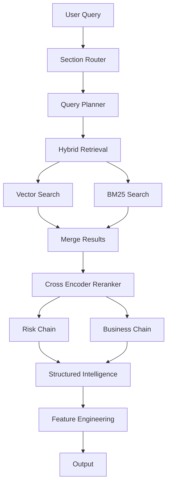

```mermaid
flowchart TD

A[User Query] --> B[Section Router]

B --> C[Query Planner]

C --> D[Hybrid Retrieval]

D --> E[Vector Search]

D --> F[BM25 Search]

E --> G[Merge Results]

F --> G

G --> H[Cross Encoder Reranker]

H --> I[Risk Chain]

H --> J[Business Chain]

I --> K[Structured Intelligence]

J --> K

K --> L[Feature Engineering]

L --> M[Output]
```
